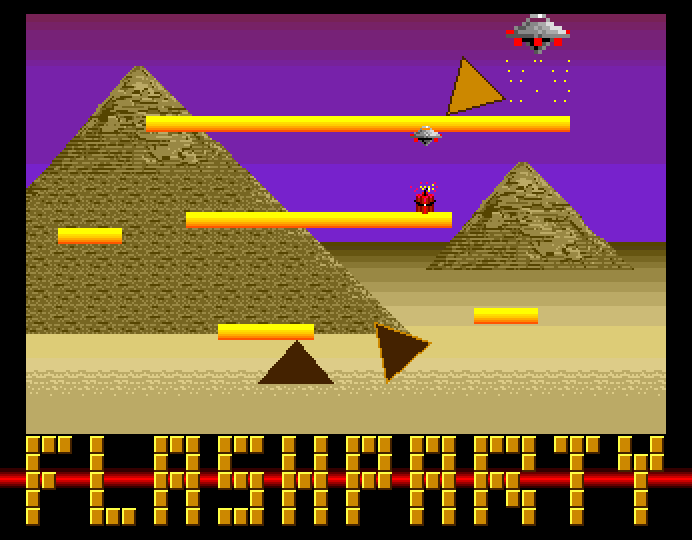

# Flashparty 2022 intro compo entry

Bombtriangles intro is just an idea for using the AProcessing routines.
The main concept here is to rotate a triangle around one of his vertex, after each rotation i change rotation vertex to simulate the triangle rolling.
Additionally I added a small engine to simulate gravity, accelleration and motions in general.

I targeted an A1000 and tried to stay under 512k of chip ram and under 16k of final compressed executablr, but unfortunately the use of pretracker and the other assets inflated the program and it was impossible for me to meet this requirements.

Actually, after uncompressed, the intro requires about 180k of chip ram, this theorically would mean it's possible to load the demo on an unexpanded A1000 as I initially intended, but, unfortunately, after the OS is loaded, only 100k are left for the programs to run.
Since I use double buffering I need 7 bitplanes, each bitplane is about 10k so... adding the music it means it not possible to say under 100k even if i keep the business code very compact.

This intro got second place at "Flashparty 2022" Buenos Aires, Argentina in the "Oldskool Intro compo".
Hope you like it.

### How to build

You just need vasm to build the whole project, shrinkler compress it, the final executable for now it's about 15k, this means we have space to add more stuff.

Devpac also compiles the project on a real amiga, just feed r.s to devpac and click assemble, it will work (or at least it works on my stock A600).

The makefile will produce this files:
1. r (for debug, the copper effect are stripped and the background color is used to evaluate performances)
2. reffect (color debug is turned off and copper effects are in place)
3. rcompressed (just reffect compressed with shrinkler)

